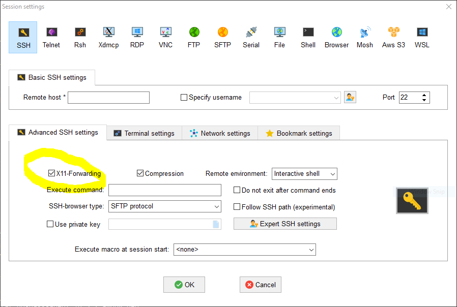

# LinuxInHA
Usually I create and destroy Linux VM in order to make some tests or develop stuff. I want to monitor/control them from HA

## Glances

If you just want to monitor the Linux machine, deeply monitor but without taking control of it, this is clearly the best option.

### Installation:
```
apt-get install glances
```

## Go-hass-agent

If you want to be able to execute scripts to that machine thru HA and you dont need a deeep monitor, this is your best option.

### Installation:

Visit [go-hass-agent official page](https://github.com/joshuar/go-hass-agent) , where you will find detailed installation instructions.

Find your package in [relases section](https://github.com/joshuar/go-hass-agent/releases) -> [At this moment was this](https://github.com/joshuar/go-hass-agent/releases/download/v10.3.2/go-hass-agent_10.3.2_amd64.deb)

```
(as root)
wget https://github.com/joshuar/go-hass-agent/releases/download/v10.3.2/go-hass-agent_10.3.2_amd64.deb
dpkg -i go-hass-agent_10.3.2_amd64.deb
apt-get install -f
dpkg -i go-hass-agent_10.3.2_amd64.deb
```
### Config:

Now you need some Xwindows server in order to export X11 sessions from Linux, I will say a very goos option is to install [Mobaxterm](https://mobaxterm.mobatek.net/). Just remember to activate X11 forwarding when configuring your ssh connection to the Linux machine.



Time to start with the basic configuration, as a non root user:

```
(as non root user)
go-hass-agent run
```
Open your HA webpage, go to your **profile** and then **security** tab (http://<ha_ip>:8123/profile/security) , click **create token**, insert a desired name, and copy the token.

Fullfill the go-hass-agent pop-up, with the token and the http://<ha_ip>:8123

You will see lots of information in the console, everything is working fine!

Open your HA webpage, go to **setting**, then go to **devices and services** and select **Movile app**, here you have your Linux machine with all the sensors.

### As a service:

Now lets make it a service in the linux machine:

```
(as root)
loginctl list-users
loginctl enable-linger
loginctl list-users
(as non root user)
systemctl --user enable go-hass-agent
systemctl --user start go-hass-agent
systemctl --user status go-hass-agent
```
